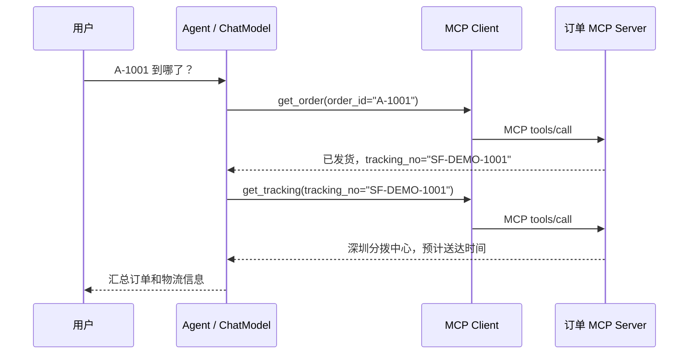

# Agent 调用 MCP 服务：订单查询案例

本例用 SpringBootAI 原生 Function Calling 闭环构建一个 Tool Calling Agent：输入一个问题，模型请求工具，框架通过 MCP 执行工具、回填结果，再让模型决定下一步或生成回答。

业务场景：查询订单 A-1001 的物流。Agent 先调用 `get_order`，从返回值取得运单号，再调用 `get_tracking`，最后汇总状态、位置和预计送达时间。A-1002 尚未发货，因此无需查物流。

案例包含真实 stdio / Streamable HTTP MCP 通信，订单和物流数据均为模拟数据。默认使用固定步骤的离线模型验证流程，它没有自然语言推理能力；加 `--real` 后由真实模型选择工具及参数。本次验证没有调用付费模型 API。

本例随 2.3.12 新增，使用了 `ChatClient.chat` 快捷入口。示例源码位于 GitHub 仓库的 `examples/example_mcp/`；请克隆仓库后按下方命令安装和运行，PyPI 安装包提供框架模块。

## 1. 一条命令跑通

在仓库根目录使用同一个 Python 环境执行：

```bash
python -m pip install -e ".[ai,mcp]"
python examples/example_mcp/agent_demo.py --trace
```

Agent 会自动启动本地 MCP 子进程、发现工具，完成请求后关闭连接和子进程。无需另外开服务终端，也无需数据库或 API Key。

预期输出：

```text
离线演示模式：固定步骤模型，不访问大模型 API；MCP 调用为真实协议调用，业务数据为模拟数据。
发现 MCP 工具： orders__get_order, orders__get_tracking
调用 MCP 工具：orders__get_order {"order_id": "A-1001"}
调用 MCP 工具：orders__get_tracking {"tracking_no": "SF-DEMO-1001"}
订单 A-1001（机械键盘）已发货。运单 SF-DEMO-1001 当前在深圳分拨中心，状态为运输中，预计明天 18:00 前（模拟时间）送达。
```

试试其他分支：

```bash
python examples/example_mcp/agent_demo.py "查询 A-1002 的物流" --trace
python examples/example_mcp/agent_demo.py "查询 A-9999 的物流" --trace
```

A-1002 只查订单，回答尚未发货；A-9999 只查订单，回答没有找到。离线模式只识别 `A-` 加四位数字的订单号；其他业务意图应使用真实模型。

## 2. 调用过程



`MCPClientManager` 发现服务的 JSON Schema 并创建工具表；`ChatClient` 把工具描述发给模型；`ChatModel.call` 执行“请求工具 → 回填结果 → 再调用模型”的循环。Agent 的业务入口不手写 MCP 请求或循环。

文件说明：

| 文件 | 职责 |
|---|---|
| [agent_demo.py](../examples/example_mcp/agent_demo.py) | Agent、MCP 连接与命令行入口 |
| [order_agent_server.py](../examples/example_mcp/order_agent_server.py) | 注解式 MCP 服务，提供两个只读查询工具 |
| [_agent_demo_model.py](../examples/example_mcp/_agent_demo_model.py) | 离线固定步骤模型，只用于验证流程 |
| [test_mcp_agent_example.py](../tests/test_mcp_agent_example.py) | 真实子进程及 HTTP 的集成测试 |

## 3. 在业务代码中使用

从仓库根目录运行时，包路径为 `examples.example_mcp`：

```python
from examples.example_mcp.agent_demo import OrderAgent

with OrderAgent() as agent:
    answer = agent.ask("订单 A-1001 到哪了？")
    print(answer)
```

接真实模型时显式传入模型实例：

```python
from springbootai.ai import configure_ai
from examples.example_mcp.agent_demo import OrderAgent

model = configure_ai()["aiChatModel"]
with OrderAgent(model) as agent:
    print(agent.ask("请查一下 A-1001 的物流，并简要说明送达时间。"))
```

以上显式创建的 `OrderAgent` 已自行持有 ChatClient 和 MCP manager，不依赖 IoC 注解代理。Web 项目可在应用启动时创建，在 shutdown 时调用 `agent.close()`，供接口复用；不要每个 HTTP 请求都启动一个 MCP 子进程。问题处理不自动保留跨请求的聊天历史。

## 4. 切换真实模型

例如在 PowerShell 配置 DeepSeek：

```powershell
$env:AI_PROVIDER = "deepseek"
$env:DEEPSEEK_API_KEY = "你的密钥"
$env:AI_ALLOW_FAKE = "false"
python examples/example_mcp/agent_demo.py --real --trace
```

模型应支持工具调用，具体回复和调用次数由模型决定。`--real` 拒绝自动配置回退出的 `FakeChatModel`；Key 或 Provider 配置缺失时直接报错。真实模型读取框架已有的环境变量 / `application.yml`，详见 [AI 配置](AI_MODULE.md#配置applicationyml)。本例只用聊天模型，不调用自动配置中的嵌入模型。

## 5. 连接独立 HTTP MCP 服务

终端一，启动订单服务：

```bash
python examples/example_mcp/order_agent_server.py
```

服务地址为 `http://127.0.0.1:8002/mcp`，仅监听本机。

终端二，连接服务：

```bash
python examples/example_mcp/agent_demo.py --mcp-url http://127.0.0.1:8002/mcp --trace
```

同时用真实模型：

```bash
python examples/example_mcp/agent_demo.py --real --mcp-url http://127.0.0.1:8002/mcp --trace
```

已有外部服务需要提供同名 `get_order(order_id)`、`get_tracking(tracking_no)` 工具及匹配的返回字段；接入其他工具时一起修改客户端白名单和系统提示。需要认证的服务在 `MCPClientProperties.headers` 中配置请求头，远程非本机地址应使用 HTTPS。客户端自动添加 `orders__` 前缀，服务端仍使用原来的工具名。

## 6. 边界与验证

服务端和客户端只开放两个查询工具，执行策略再次检查工具名。默认子进程不继承宿主完整环境，模型密钥不会自动传给工具进程。示例的订单数据公开且虚构；接真实订单系统时，工具内部还必须验证用户身份和订单归属。

单次 MCP 请求超时为 15 秒；Agent 工具闭环最多 4 轮，累计 Token 预算为 16000，单次模型输出上限为 1024。模型网络超时和重试沿用 AI 配置，这些限制不是整个请求的绝对墙钟时间保证。`--trace` 会打印工具参数，只适合示例排查，处理真实订单时应按实际需要脱敏。

```bash
python -m pytest tests/test_mcp_agent_example.py tests/test_mcp_module.py --no-cov -q
```

测试使用离线模型，但 MCP stdio 测试真的启动独立 Python 子进程，HTTP 测试在本机随机端口启动真实 MCP 服务。不会调用外部模型 API。
